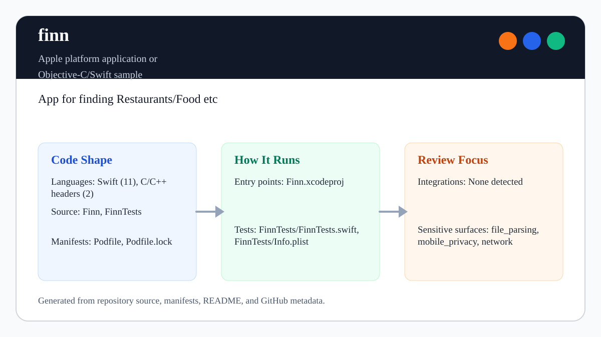

# finn

<!-- README-OVERVIEW-IMAGE -->


## Overview

`garethpaul/finn` is an Apple platform application or Objective-C/Swift sample. App for finding Restaurants/Food etc

This README is based on the checked-in source, manifests, scripts, and repository metadata on the `master` branch. The project language mix found during review was: Swift (11), C/C++ headers (2).

## Repository Contents

- `README.md` - project overview and local usage notes
- `Podfile` - Apple platform dependency metadata
- `Finn` - source or example code
- `Finn.xcodeproj` - Xcode project file
- `FinnTests` - source or example code
- `Podfile.lock` - Apple platform dependency metadata
- `SECURITY.md` - security reporting and disclosure guidance
- `VISION.md` - project direction and maintenance guardrails

Additional scan context:

- Source directories: Finn, FinnTests
- Dependency and build manifests: Podfile, Podfile.lock
- Entry points or build surfaces: Finn.xcodeproj
- Test-looking files: FinnTests/FinnTests.swift, FinnTests/Info.plist

## Getting Started

### Prerequisites

- Git
- macOS with Xcode for building Apple platform projects
- CocoaPods if dependencies need to be installed

### Setup

```bash
git clone https://github.com/garethpaul/finn.git
cd finn
pod install
```

The setup commands above are derived from repository files. Legacy mobile, Python, or JavaScript samples may require older SDKs or package versions than a modern workstation uses by default.

## Running or Using the Project

- Open `Finn.xcodeproj` in Xcode, choose the app or sample scheme, and run it on the matching simulator/device.

## Testing and Verification

- Xcode's test action or `xcodebuild test` with the appropriate scheme and destination

When the required SDK or runtime is unavailable, use static checks and source review first, then verify on a machine that has the matching platform toolchain.

## Configuration and Secrets

- No required secret or credential file was identified in the repository scan. If you add integrations later, keep secrets out of git.

## Security and Privacy Notes

- Review changes touching network requests, sockets, or service endpoints; examples from the scan include Finn/Info.plist, FinnTests/Info.plist, Podfile.
- Review changes touching mobile permissions or privacy-sensitive device data; examples from the scan include Finn/Info.plist, Finn/ViewController.swift.
- Review changes touching file, media, JSON, XML, CSV, OCR, or data parsing; examples from the scan include Finn/API.swift, Finn/FinnPickerView.swift, Finn/Info.plist, Finn/Picture.swift, and 4 more.

## Maintenance Notes

- This looks like an Apple platform project or sample. Xcode, Swift, CocoaPods, and deployment target versions may need to match the original project era.
- See `SECURITY.md` for vulnerability reporting and safe research guidance.
- See `VISION.md` for project direction and contribution guardrails.

## Contributing

Keep changes small and tied to the project that is already present in this repository. For code changes, document the toolchain used, avoid committing generated dependency directories or local configuration, and update this README when setup or verification steps change.
